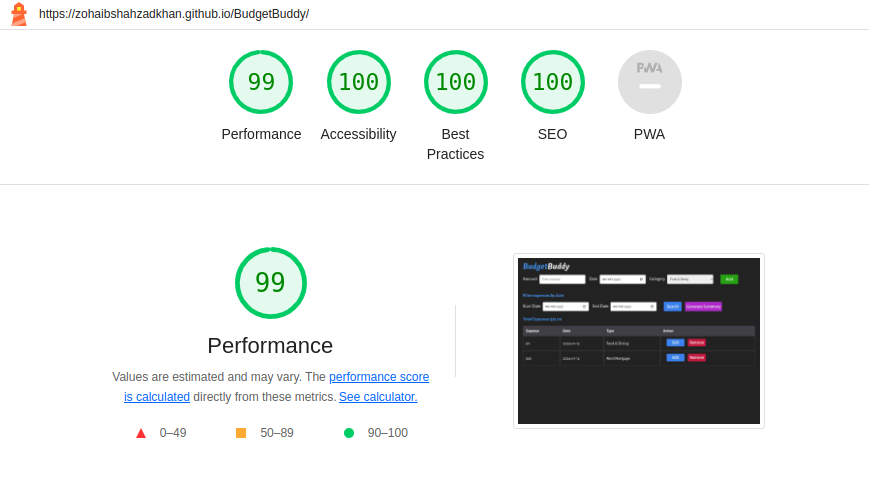

# BudgetBuddy - Your Personal Expense Tracker
Welcome to BudgetBuddy, your go-to solution for managing your finances effortlessly. BudgetBuddy is a user-friendly and intuitive Expense Tracker designed to help you keep a keen eye on your spending habits, making financial management a breeze.

Experience the magic of the live site by simply clicking right here - <a href="https://zohaibshahzadkhan.github.io/BudgetBuddy/" target="_blank"> BudgetBuddy </a>

## Target Audience

1. **Individuals on a Budget:**
   - People looking to manage and stick to a specific budget for personal financial goals.

2. **Students:**
   - Students who want to keep track of their expenses while studying, managing allowances, or part-time income.

3. **Young Professionals:**
   - Individuals starting their careers who want to build good financial habits and track their spending.

4. **Freelancers and Gig Workers:**
   - Freelancers and gig workers who need to monitor their income and expenses with irregular payment schedules.

5. **Small Business Owners:**
   - Entrepreneurs and small business owners looking for a simple solution to track business expenses.

6. **Families:**
   - Families who want to manage their household budget, track shared expenses, and plan for future expenditures.

7. **Travel Enthusiasts:**
   - People who frequently travel and want to keep a record of their travel expenses.

8. **Savers and Investors:**
   - Individuals who are saving for specific goals or investing and want to track their disposable income.

9.  **Financial Beginners:**
    - Those new to personal finance, looking for a user-friendly tool to understand and control their spending.

10. **Expense-Conscious Consumers:**
    - People who prioritize financial responsibility and are conscious of their spending habits.

## User Stories

1. **Adding an Expense:**
   - As a user, I want to add a new expense with details such as expense amount, date and expense category, so I can keep track of my spending.

2. **Editing an Expense:**
   - As a user, I want to edit an existing expense, including updating the expense amount, date, and category, to reflect any changes or corrections.

3. **Removing an Expense:**
   - As a user, I want to remove an expense from the list, providing me with the flexibility to manage my recorded expenses.

4. **Saving Expenses in Local Storage:**
   - As a user, I want my entered expenses to be saved in local storage, ensuring that my data persists even if I close or reload the app.

5. **Filtering Expenses by Start and End Date:**
   - As a user, I want to filter my expenses based on a specified start and end date range, allowing me to view expenses for a specific time period.

6. **Calculating Total Sum of User Expenses:**
   - As a user, I want the app to calculate and display the total sum of my expenses, giving me an overview of my overall spending.

7. **Generating Summary of Total Expenses by Categories:**
   - As a user, I want to generate a summary of my total expenses categorized by expense types, helping me understand where my money is going.

8.  **Updating Total Sum when Filtering Expenses by Date Range:**
    - As a user, I want to filter my expenses by selecting a date range, helping me analyze my spending for specific time intervals.

9.  **Input Validation and Error Display:**
    - As a meticulous user who values accurate and error-free data entry, I want the Expense Tracker app to perform input validation to ensure that the information entered is valid and, in cases of errors, provide clear and descriptive error messages.

## Wireframes

In order to facilitate a systematic approach towards the implementation of user needs and goals throughout the web development process, the selected designs have been strategically mapped with relevant user story numbers. This carefully designed integration shall provide for a user oriented design, which complies with the identified requirements set out in each user story.

| Add Expense                                                           |   Mapped to user story    |
| :-------------------------------------------------------------------- | :-----------------------: |
|  | <b>(1, 4, 5, 6, 8, 9)</b> |

| update Expense                                                        |  Mapped to user story  |
| :-------------------------------------------------------------------- | :--------------------: |
|  | <b>(2, 3, 4, 8, 9)</b> |

| Summary                                                                 | Mapped to user story |
| :---------------------------------------------------------------------- | :------------------: |
|  |      <b>(7)</b>      |

## Features

1. **Adding an Expense**
   
   Allows users to input new expenses with details such as a description, date, and expense category.

   

2. **Editing an Expense**
   
   Enables users to modify existing expenses, including updating the description, date, and category.

    
    

3. **Removing an Expense**
   
   Provides users with the ability to delete expenses from the list, offering flexibility in managing recorded data.

   
   
4. **Saving Expenses in Local Storage**
   
   Persists entered expenses in the local storage, ensuring data remains intact even after closing or reloading the app.

   

5. **Filtering Expenses by Start and End Date**
   
   Allows users to filter expenses based on a specified start and end date range, facilitating analysis for specific time periods.

   

6. **Calculating Total Sum of User Expenses**
   
   Automatically computes and displays the total sum of user expenses, offering a quick overview of overall spending.

   

7. **Generating Summary of Total Expenses by Categories**
   
   Generates a summarized view of total expenses categorized by expense types, providing insights into spending patterns.
   
   

8. **Input Validation and Error Display**
    
   Implements input validation to ensure accurate data entry and displays clear error messages to guide users in correcting any issues.

   
   
   
   
   

## Future Features
Outline of Upcoming Features:

1. **Dark and Light Theme Toggle**
   - As a user, I want the option to toggle between dark and light themes in the app, allowing me to customize the interface based on my preferences.

2. **Changing the Currency**
   - As a user, I want the flexibility to change the currency for my expenses, ensuring that the displayed amounts align with my preferred currency.

3. **Selecting an Expense Category**
   - As a user, I want the ability to select a specific expense category to view only those expenses, providing a focused perspective on particular types of spending.
  
4. **Confirmation modal**
   - As a user, I want to get the confirmation modal before removing an item.

## Testing 

### Validator Testing

#### HTML Validation

[index.html validator link ](https://validator.w3.org/nu/?doc=https%3A%2F%2Fzohaibshahzadkhan.github.io%2FBudgetBuddy%2F)

#### CSS Validation

[css validator link ](https://jigsaw.w3.org/css-validator/validator?uri=https%3A%2F%2Fzohaibshahzadkhan.github.io%2FBudgetBuddy%2Fassets%2Fcss%2Fstyle.css&profile=css3svg&usermedium=all&warning=1&vextwarning=&lang=en)

#### JS Validation Metrics
No errors were found when passing through the official Jshint validator
The following metrics were returned:

-  There are 24 functions in this file.
-  Function with the largest signature take 2 arguments, while the median is 1.
-  Largest function has 18 statements in it, while the median is 4.5.
-  The most complex function has a cyclomatic complexity value of 4 while the median is 1.5.

### Accessibility Testing

To assess the colors and fonts, I utilized Lighthouse within Google DevTools. The outcomes are presented below:

## Browser Testing

**Layout:** Testing layout and appearance of site for consistency throughout browsers.

**Functionality:** Ensuring all links, navigation and form submit functions as expected throughout browsers.

| Browser | Layout | Functionality |
| :-----: | :----: | :-----------: |
| Chrome  |   ✔    |       ✔       |

### Testing User Stories

|                                                                                                                     Expectation                                                                                                                      |                                                                                                                                                                   Result                                                                                                                                                                   |
| :--------------------------------------------------------------------------------------------------------------------------------------------------------------------------------------------------------------------------------------------------: | :----------------------------------------------------------------------------------------------------------------------------------------------------------------------------------------------------------------------------------------------------------------------------------------------------------------------------------------: |
|                                                      As a user, I want to add a new expense with details such as expense amount, date and expense category, so I can keep track of my spending.                                                      |                                                                                     As a user, I can add an expense by selecting specific date and Category     Evidence:                                                                                          |
|                                                   As a user, I want to edit an existing expense, including updating the expense amount, date, and category, to reflect any changes or corrections.                                                   |                                                            As a user, I can edit an existing expense, including updating the expense amount, date, and category, to reflect any changes or corrections.       Evidence:                                                              |
|                                                               As a user, I want to remove an expense from the list, providing me with the flexibility to manage my recorded expenses.                                                                |                                                                                                         As a potential user, I can remove existing expense    Evidence:                                                                                                           |
|                                                        As a user, I want my entered expenses to be saved in local storage, ensuring that my data persists even if I close or reload the app.                                                         |                                                                                              As a user, I see my expenses when I revisit the website          Evidence:                                                                                               |
|                                                            As a user once I contact candidate I should be notified with a thankyou message so than I know that my message has been sent.                                                             |                                                     As a user, I want to filter my expenses based on a specified start and end date range, allowing me to view expenses for a specific time period.     Evidence:                                                      |
|                                                            As a user, I want the app to calculate and display the total sum of my expenses, giving me an overview of my overall spending.                                                            |                                                                                       As a user , I can find the total expense of my expenses         Evidence:                                                                                         |
|                                                      As a user, I want to generate a summary of my total expenses categorized by expense types, helping me understand where my money is going.                                                       |                                                                                                                                      Evidence:                                                                                                                                    |  |
| As a meticulous user who values accurate and error-free data entry, I want the Expense Tracker app to perform input validation to ensure that the information entered is valid and, in cases of errors, provide clear and descriptive error messages |     Evidence:  |  |

## Manual Testing Summary

|       Functionality        |                          Expected Outcome                           |                         User Action                          |                         Test Result                          |
| :------------------------: | :-------------------------------------------------------------------: | :-----------------------------------------------------------: | :----------------------------------------------------------: |
|    **Adding an Expense**   |      New expense is added with correct details and appears in the list      | Filled out the expense details and clicked "Add Expense" button |               New expense added successfully as expected               |
|    **Editing an Expense**  | Existing expense details are updated, and the changes are reflected in the list |    Clicked "Edit" on an expense, modified details, and saved    | Existing expense details were successfully updated as expected |
|   **Removing an Expense**  |              Selected expense is removed and no longer appears in the list              |         Clicked "Remove" on an expense         |           Selected expense was successfully removed as expected          |
| **Saving Expenses Locally** |        Entered expenses are saved locally and persist across app reloads         |             Added expenses and closed/reopened the app             | Entered expenses were persisted locally and reappeared after app reload |
|  **Filtering by Date Range** | Expenses are filtered based on the selected date range, displaying relevant entries |         Selected start and end dates, then clicked "Search"         | Expenses were successfully filtered based on the selected date range |
|   **Total Expense Calculation**   |     App calculates and displays the total sum of user expenses accurately      | Viewed total expense amount on the dashboard and cross-verified |  Total expense displayed accurately, matching the sum of individual expenses |
| **Generating Expense Summary by Categories** |       Summary is generated, categorizing total expenses by expense types       |                  Clicked "Generate Summary" button                   |      Summary was successfully generated, categorizing expenses by types      |
|  **Filtering Expenses by Date Range** |    Expenses are filtered based on a specified date range, showing relevant entries    |    Selected a date range and clicked "Filter by Date Range" button    |    Expenses were successfully filtered based on the specified date range    |
| **Input Validation and Error Display** |      Proper error messages are shown when incorrect or missing inputs are entered     | Attempted to add an expense with missing or incorrect information |      Clear and descriptive error messages were displayed, guiding the user       |

This manual testing summary provides a detailed overview of the testing scenarios, ensuring the robustness and accuracy of the Expense Tracker app's functionalities.

